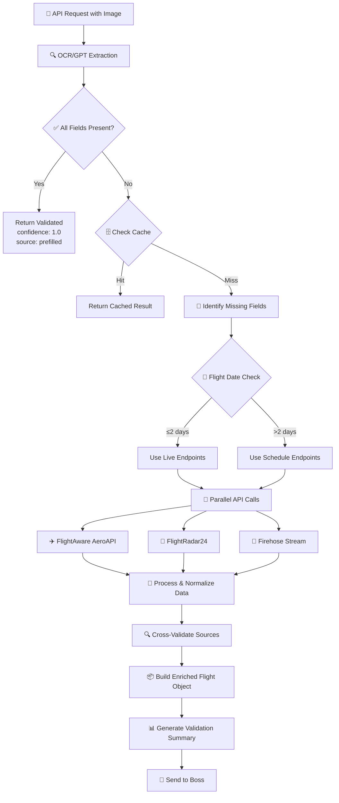

# 🚀 Flight Intel Validation Pipeline

## 📋 Overview
This flowchart illustrates the complete data flow from receiving an API request with flight schedule images to delivering validated, enriched flight data.

## 🔄 Process Flow



## 📊 Detailed ASCII Flow

```
┌────────────────────────────────────────────────────────────────────────┐
│                         🚀 FLIGHT VALIDATION API                        │
│                          Image → Enriched Data                          │
└────────────────────────────────────────────────────────────────────────┘

┌─────────────────────────────┐     ┌─────────────────────────────────────┐
│    📸 IMAGE RECEIVED        │     │        💾 VALIDATION CACHE          │
│  • Flight schedule photo    │     │  • Key: flight_no + date            │
│  • PDF document            │     │  • TTL: 15 minutes                  │
│  • Screenshot              │     │  • Max size: 1000 entries           │
└──────────────┬──────────────┘     └─────────────────────────────────────┘
               │                                      ▲
               ▼                                      │
┌─────────────────────────────────────────────────────┼───────────────────┐
│                      🔍 OCR EXTRACTION PHASE        │                    │
├─────────────────────────────────────────────────────┴───────────────────┤
│  • Extract: flight_no, date, origin, dest, times                        │
│  • Parse schedule format                                                 │
│  • Generate initial quality score                                        │
│  • Output: Raw flight data array                                        │
└─────────────────────────────────────────────────────────────────────────┘
                                    │
                                    ▼
┌─────────────────────────────────────────────────────────────────────────┐
│                    🔎 VALIDATION DECISION TREE                          │
└─────────────────────────────────────────────────────────────────────────┘
                                    │
                ┌───────────────────┴───────────────────┐
                │                                       │
                ▼                                       ▼
    ┌─────────────────────┐                ┌─────────────────────────┐
    │  ✅ ALL FIELDS OK   │                │  ⚠️  MISSING FIELDS    │
    │                     │                │                         │
    │  • Origin ✓         │                │  • Origin ✗             │
    │  • Dest ✓           │                │  • Dest ✗               │
    │  • Times ✓          │                │  • Schedule times ✗     │
    │                     │                │                         │
    │  SKIP VALIDATION    │                │  PROCEED TO APIs        │
    └─────────────────────┘                └────────────┬────────────┘
                                                        │
                                                        ▼
┌─────────────────────────────────────────────────────────────────────────┐
│                        🌐 PARALLEL API ORCHESTRATION                     │
├─────────────────────────────────────────────────────────────────────────┤
│                                                                         │
│  ┌─────────────────────┐  ┌─────────────────────┐  ┌─────────────────┐ │
│  │   🟦 FLIGHTAWARE    │  │   🟧 FLIGHTRADAR24  │  │   🟩 FIREHOSE   │ │
│  ├─────────────────────┤  ├─────────────────────┤  ├─────────────────┤ │
│  │ Confidence: 0.95    │  │ Confidence: 0.85    │  │ Confidence: 0.99│ │
│  │                     │  │                     │  │                 │ │
│  │ • /flights/{ident}  │  │ • /flight/list.json │  │ • Live stream   │ │
│  │ • /schedules/{date} │  │ • Schedule search   │  │ • FLIFO msgs    │ │
│  │ • /history/flights  │  │ • Aircraft data     │  │ • Gate info     │ │
│  └─────────────────────┘  └─────────────────────┘  └─────────────────┘ │
│                                                                         │
└─────────────────────────────────────────────────────────────────────────┘
                                    │
                                    ▼
┌─────────────────────────────────────────────────────────────────────────┐
│                      🔧 DATA PROCESSING ENGINE                          │
├─────────────────────────────────────────────────────────────────────────┤
│                                                                         │
│  1️⃣  Extract & Normalize                                               │
│     • ICAO → IATA conversion (KJFK → JFK)                             │
│     • Timezone conversion (UTC → Local)                                │
│     • Time format (ISO → HHMM)                                        │
│                                                                         │
│  2️⃣  Fill Missing Fields                                               │
│     • Map API fields to schema                                         │
│     • Priority: Firehose > AeroAPI > FR24                            │
│                                                                         │
│  3️⃣  Cross-Validate                                                    │
│     • Detect conflicts between sources                                 │
│     • Apply confidence weighting                                       │
│     • Generate warnings for discrepancies                             │
│                                                                         │
└─────────────────────────────────────────────────────────────────────────┘
                                    │
                                    ▼
┌─────────────────────────────────────────────────────────────────────────┐
│                        📦 ENRICHED FLIGHT OBJECT                        │
├─────────────────────────────────────────────────────────────────────────┤
│ {                                                                       │
│   "date": "08/15/2025",                                               │
│   "flight_no": "AA123",                                               │
│   "origin": "JFK",              ← Filled/Corrected                    │
│   "dest": "LAX",                ← Filled/Corrected                    │
│   "sched_out_local": "0830",    ← Added from API                      │
│   "sched_in_local": "1145",     ← Added from API                      │
│   "validation_result": {                                               │
│     "is_valid": true,                                                  │
│     "confidence": 0.95,                                                │
│     "source": "aeroapi+fr24+firehose",                                │
│     "filled_fields": {                                                 │
│       "origin": "JFK",                                                 │
│       "sched_out_local": "0830"                                       │
│     },                                                                  │
│     "corrections": {                                                    │
│       "dest": "LAX"  // Was "LOS"                                     │
│     }                                                                   │
│   }                                                                     │
│ }                                                                       │
└─────────────────────────────────────────────────────────────────────────┘
                                    │
                                    ▼
┌─────────────────────────────────────────────────────────────────────────┐
│                         📊 FINAL REPORT                                 │
├─────────────────────────────────────────────────────────────────────────┤
│                                                                         │
│  ✅ Validation Summary                                                  │
│     • Total flights: 25                                                │
│     • Valid flights: 24 (96%)                                          │
│     • Average confidence: 0.92                                         │
│     • Fields filled: 47                                                │
│     • Processing time: 3.2s                                            │
│                                                                         │
│  📈 Quality Metrics                                                     │
│     • OCR Quality: 0.85                                                │
│     • Validation Quality: 0.92                                         │
│     • Combined Score: 0.87                                             │
│                                                                         │
│  ⚠️  Warnings                                                           │
│     • Flight UA456: Conflicting dest (ORD vs MDW)                     │
│     • Flight DL789: No data found in APIs                             │
│                                                                         │
└─────────────────────────────────────────────────────────────────────────┘
```

## 🔑 Key Decision Points

### 1. **Cache Strategy** 
- **TTL**: 15 minutes
- **Max Size**: 1000 entries
- **Key**: `flight_no + date`

### 2. **API Selection Logic**
```
if (date_delta <= -10 days):
    use /history/flights/{ident}
elif (-10 < date_delta <= 2):
    use /flights/{ident}
else:
    use /schedules/{date}/{date}
```

### 3. **Confidence Hierarchy**
| Source | Confidence | Priority |
|--------|------------|----------|
| Firehose | 0.99 | 1st |
| AeroAPI | 0.95 | 2nd |
| FR24 | 0.85 | 3rd |
| Heuristic | 0.50 | Last |

### 4. **Special Cases**
- **UPS Internal**: `A12345R` format → Skip external APIs
- **Missing Credentials**: Gracefully degrade to available APIs
- **Future Flights**: Use schedule endpoints for >2 days out

## 🚨 Error Handling

```
┌─────────────────┐     ┌──────────────────┐     ┌─────────────────┐
│   API Timeout   │     │   Invalid Data   │     │   No Results    │
└────────┬────────┘     └────────┬─────────┘     └────────┬────────┘
         │                       │                          │
         └───────────────────────┴──────────────────────────┘
                                │
                                ▼
                    ┌───────────────────────┐
                    │  Fallback Heuristics  │
                    │  • Pattern matching    │
                    │  • Confidence: 0.50   │
                    └───────────────────────┘
```

## 📝 Output Format

The system produces enriched flight objects with:
- ✅ All missing fields populated
- 🔄 Incorrect data corrected
- 📊 Confidence scores for each validation
- 🔍 Source attribution for audit trail
- ⚠️ Warnings for data conflicts

---

*Built for reliability, speed, and accuracy in flight schedule validation* 🛫